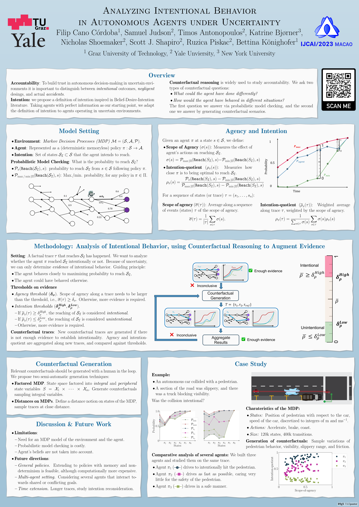

---

# \*\*  NOW  \*\*

---

[Link](https://arxiv.org/abs/2205.04887) to the paper and slides that for my presentation happening now.

---
# \*\*  NEW  \*\*
---
I am in Macao to present our paper
<strong>
[Analyzing Intentional Behavior in Autonomous Agents under Uncertainty](https://doi.org/10.24963/ijcai.2023/42)
</strong>
in the International Joint Conference of Artificial Intelligence (IJCAI). 
I am also presenting an extended version of our paper 
<strong>
[Search-Based Testing of Reinforcement Learning](https://arxiv.org/abs/2205.04887)
</strong>
at the Joint AI Safety - Safe RL Workshop @ IJCAI'23.

---

<!-- <object data="./../files/ICAPS2023_Poster.pdf" type="application/pdf" width="700px" height="700px">
    <embed src="./../files/ICAPS2023_Poster.pdf">
        
This browser does not support PDFs. Please download the PDF to view it: <a href="./../files/ICAPS2023_Poster.pdf">Download PDF</a>.

    </embed>
</object>
-->

---

## About me

---

I am a PhD student in the Institute of Applied Information Processing and Communications
([IAIK](https://www.iaik.tugraz.at) by its German initials) at the Graz University of Technology. 
 
I use formal methods to develop trust in
AI.
I am particularly interested in accountability of AI systems and also in runtime verification and enforcement of safety-critical properties.
 
I received my MSc degree in Advanced Mathematics and Mathematical Engineering from [BarcelonaTech](https://www.upc.edu) in 2019.