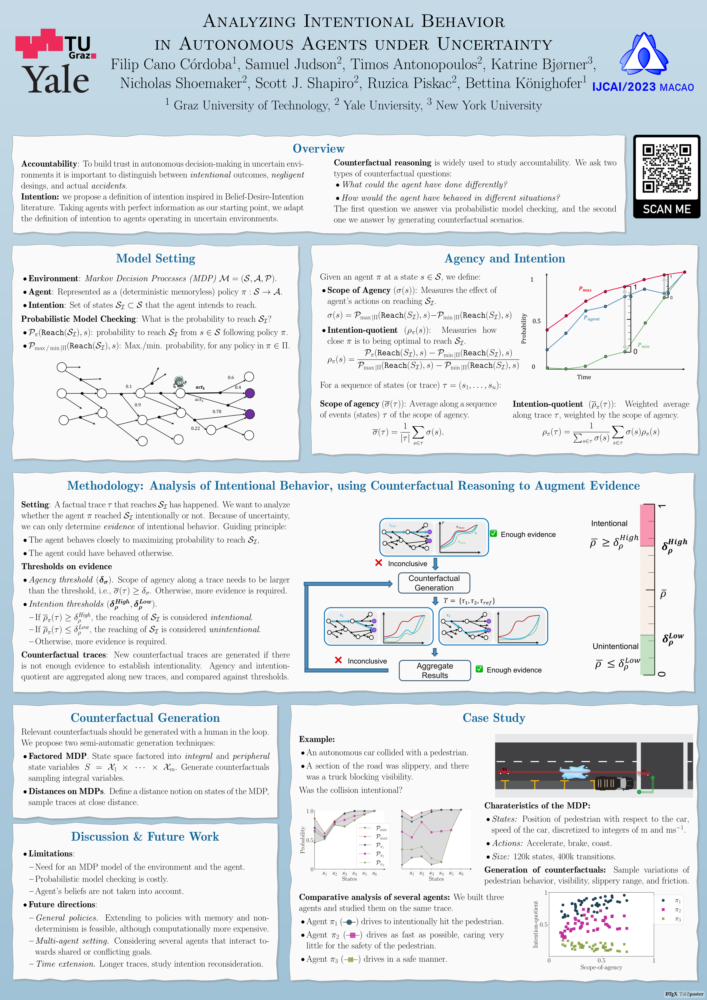

---
<!-- 

# \*\*  NOW  \*\*

---

[Link](https://doi.org/10.24963/ijcai.2023/42) to the paper and slides that for my presentation happening now.

--- -->

<!-- # \*\*  NOW  \*\*

---

I am currently in Krete, Greece, to present our paper
<strong>
[Formal XAI via Syntax-Guided Synthesis](https://filipcano.org/files/isola23-paper.pdf)
</strong>
in the conference AISoLA 2023.

--- -->

<!-- # \*\*  NEW  \*\*
---
I was recently in Macao to present our paper
<strong>
[Analyzing Intentional Behavior in Autonomous Agents under Uncertainty](https://doi.org/10.24963/ijcai.2023/42)
</strong>
in the International Joint Conference of Artificial Intelligence (IJCAI). 

I also presented an extended abstract version of our paper 
<strong>
[Search-Based Testing of Reinforcement Learning](https://arxiv.org/abs/2205.04887)
</strong>
at the Joint AI Safety - Safe RL Workshop @ IJCAI'23.

---

<!-- <object data="./../files/ICAPS2023_Poster.pdf" type="application/pdf" width="700px" height="700px">
    <embed src="./../files/ICAPS2023_Poster.pdf">
        
This browser does not support PDFs. Please download the PDF to view it: <a href="./../files/ICAPS2023_Poster.pdf">Download PDF</a>.

    </embed>
</object>
-->

## About me

---

<!-- Filip Cano is a Postdoctoral researcher at the Institute of Science and Technology Austria (ISTA). 
His research focuses on formal methods to develop trustworthy AI systems, particularly in sequential decision-making contexts, like reinforcement learning. His interests include explainability and accountability of AI systems, as well as verification and enforcement of safety-critical properties. 
Prior to joining ISTA, he earned a PhD in Computer Science at Graz University of Technology. -->

NOW: 

fwlab_presentation_templateFILIP.pptx

Filip Cano is a Postdoctoral Researcher at the Institute of Science and Technology Austria (ISTA), working at the intersection of formal methods and responsible AI. 
His research develops runtime monitoring and enforcement techniques for AI-supported sequential decision-making systems. His broader interests include safe reinforcement learning, runtime assurance, explainability, and accountability for autonomous agents. 
Prior to joining ISTA, he earned a PhD in Computer Science at Graz University of Technology, with a thesis on safety, fairness, and accountability of autonomous systems, and an MSc in Advanced Mathematics and Mathematical Engineering from BarcelonaTech in 2019.

<!-- Prior to joining TU Graz, he earned an MSc in Advanced Mathematics and Mathematical Engineering from BarcelonaTech in 2019. -->

---

## Selected publications

 
<strong style="color:#52adc8">Energy Shields for Fairness</strong>  
 Filip Cano, Thomas A. Henzinger, Konstantin Kueffner.
 
ACM Conference on Fairness, Accountability, and Transparency (<strong>FAccT</strong>) 2026.

 

<strong> Abstract: </strong>
Runtime fairness is not a one-time constraint but a dynamic property evaluated over a sequence of decisions. To ensure fairness at runtime it is necessary to account for past decisions, information neglected by conventional, static classifiers. Traditional fairness shields enforce runtime fairness abruptly, by intervening deterministically whenever a sequence of decisions violates the target for a running fairness measure. This motivates our main conceptual contribution: energy shields. An energy shield is a novel, lightweight, adaptive controller that monitors a sequence of decisions and intervenes probabilistically to ensure runtime fairness smoothly, by utilizing physics-inspired energy functions to nudge the sequence towards fairness: the more unfair the decisions, the stronger the nudging force becomes. This makes energy shields the first fairness shields to provide both short-term safety and long-term liveness guarantees. Safety ensures that the running fairness measure stays within a running target interval with high probability, and liveness ensures that the limit of the fairness measure lies within the limit target interval. Intuitively, the short-term specifies the tolerated fairness values and the long-term specifies the desired fairness values. We also provide a synthesis procedure for constructing the least intrusive energy shield for a given target specification, and demonstrate its efficiency experimentally. As a sanity check for the theoretical contributions, we evaluate our energy shields against existing fairness shields through the lens of short- and long-term fairness.
 
 

---

 
<strong style="color:#52adc8">Fairness Shields: Safeguarding against Biased Decision Makers</strong>  
 <strong>Filip Cano</strong>, Thomas A. Henzinger, Bettina Könighofer, Konstantin Kueffner, Kaushik Mallik.
 
AAAI Conference on Artificial Intelligence (<strong>AAAI</strong>) 2025.

 

<strong> Abstract: </strong>
As AI-based decision-makers increasingly influence decisions that affect humans, it is crucial to ensure their decisions are fair and unbiased. Most algorithms for fair decision-making provide probabilistic guarantees of fairness over the long run, not providing any guarantees at specific intervals, such as yearly or quarterly. In this paper, we introduce a novel neurosymbolic approach to guarantee fairness in every finite run through the use of a symbolic runtime enforcer called a *fairness shield*. The fairness shield monitors and minimally intervenes in the decision-maker’s decisions to ensure that fairness criteria are met either within a bounded horizon or periodically, while also minimizing the costs associated with such interventions as specified by a given cost function. Given a distribution over future decisions and their costs, we present algorithms to compute fairness shields by solving a bounded-horizon optimal control problem. We present synthesis algorithms for four types of fairness shields, each tailored to different operational settings. Our empirical evaluation demonstrates the effectiveness of these shields in ensuring fairness while maintaining cost efficiency across various scenarios.
 
 

---

 
<strong style="color:#52adc8">Analyzing Intentional Behavior in Autonomous Agents under Uncertainty</strong>  
<strong>Filip Cano Córdoba</strong>, Samuel Judson, Timos Antonopoulos, Katrine Bjørner, Nick Shoemaker, Scott J. Shapiro, Ruzica Piskac, Bettina Könighofer.
 
International Joint Conference of Artificial Intelligence (<strong>IJCAI</strong>) 2023.

 

<strong> Abstract: </strong>
Principled accountability for autonomous decision-making in uncertain environments requires distinguishing intentional outcomes from negligent designs from actual accidents. We propose analyzing the behavior of autonomous agents through a quantitative measure of the evidence of intentional behavior. We model an uncertain environment as a Markov Decision Process (MDP). For a given scenario, we rely on probabilistic model checking to compute the ability of the agent to influence reaching a certain event. We call this the scope of agency. We say that there is evidence of intentional behavior if the scope of agency is high and the decisions of the agent are close to being optimal for reaching the event. Our method applies counterfactual reasoning to automatically generate relevant scenarios that can be analyzed to increase the confidence of our assessment. In a case study, we show how our method can distinguish between 'intentional' and 'accidental' traffic collisions.
 
 

BibTex:

<pre>
@inproceedings{canocordoba2023analyzing,
  title={Analyzing Intentional Behavior in Autonomous Agents under Uncertainty},
  author={Cano C{\'o}rdoba, Filip and Judson, Samuel and Antonopoulos, Timos and Bj{\o}rner, Katrine and Shoemaker, Nicholas and Shapiro, Scott J and Piskac, Ruzica and K{\"o}nighofer, Bettina},
  booktitle = {Proceedings of the Thirty-Second International Joint Conference on Artificial Intelligence, {IJCAI} 2023},
  year={2023}
}

</pre>

---

 
<strong style="color:#52adc8">Safety Shielding under Delayed Observation</strong>  
<strong>Filip Cano Córdoba</strong>, Alexander Palmisano, Martin Fränzle, Roderick Bloem, Bettina Könighofer. 
 
International Conference on Automated Planning and Scheduling (<strong>ICAPS</strong>) 2023.

 

<strong> Abstract: </strong>
Agents operating in physical environments need to be able to handle delays in the input and output signals since neither data transmission nor sensing or actuating the environment are instantaneous. Shields are correct-by-construction runtime enforcers that guarantee safe execution by correcting any action that may cause a violation of a formal safety specification. Besides providing safety guarantees, shields should interfere minimally with the agent. Therefore, shields should pick the safe corrective actions in such a way that future interferences are most likely minimized. Current shielding approaches do not consider possible delays in the input signals in their safety analyses. In this paper, we address this issue. We propose synthesis algorithms to compute delay-resilient shields that guarantee safety under worst-case assumptions on the delays of the input signals. We also introduce novel heuristics for deciding between multiple corrective actions, designed to minimize future shield interferences caused by delays. As a further contribution, we present the first integration of shields in a realistic driving simulator. We implemented our delayed shields in the driving simulator Carla. We shield potentially unsafe autonomous driving agents in different safety-critical scenarios and show the effect of delays on the safety analysis.
 
 

BibTex:

<pre>
@article{Cano2023, 
  title={Safety Shielding under Delayed Observation}, 
  author={Cano Córdoba, Filip and Palmisano, Alexander and Fränzle, Martin and Bloem, Roderick and Könighofer, Bettina}, 
  journal={Proceedings of the International Conference on Automated Planning and Scheduling}, 
  volume={33},  
  number={1}, 
  pages={80-85},
  year={2023}
}

</pre>

