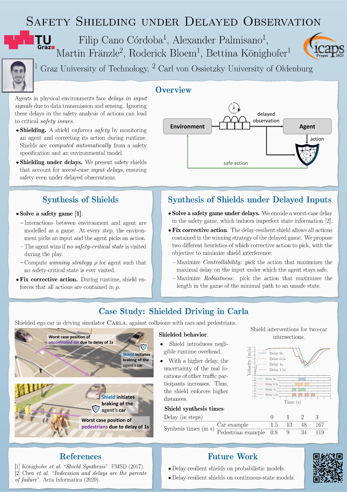

---

# \*\*  NEW  \*\*

---

I'm in Prague to present our paper 
<strong>
Safety Shielding under Delayed Observation
</strong>
in the International Conference of Automated Planning and Scheduling (ICAPS)

<iframe src="https://tugraziaik-my.sharepoint.com/personal/filip_cano_iaik_tugraz_at/_layouts/15/Doc.aspx?sourcedoc={f8ea531c-1cc4-47cb-993b-d415c917ac58}&amp;action=embedview&amp;wdAr=1.77734375" width="600px" height="363px" frameborder="0">This is an embedded <a target="_blank" href="https://office.com">Microsoft Office</a> presentation, powered by <a target="_blank" href="https://office.com/webapps">Office</a>.</iframe>

<!-- <object data="./../files/ICAPS2023_Poster.pdf" type="application/pdf" width="700px" height="700px">
    <embed src="./../files/ICAPS2023_Poster.pdf">
        
This browser does not support PDFs. Please download the PDF to view it: <a href="./../files/ICAPS2023_Poster.pdf">Download PDF</a>.

    </embed>
</object> -->

---

## About me

---

I am a PhD student in the Institute of Applied Information Processing and Communications
([IAIK](https://www.iaik.tugraz.at) by its German initials) at the Graz University of Technology. 
 
I use formal methods to develop trust in
AI.
I am particularly interested in accountability of AI systems and also in runtime verification and enforcement of safety-critical properties.
 
I received my MSc degree in Advanced Mathematics and Mathematical Engineering from [BarcelonaTech](https://www.upc.edu) in 2019.